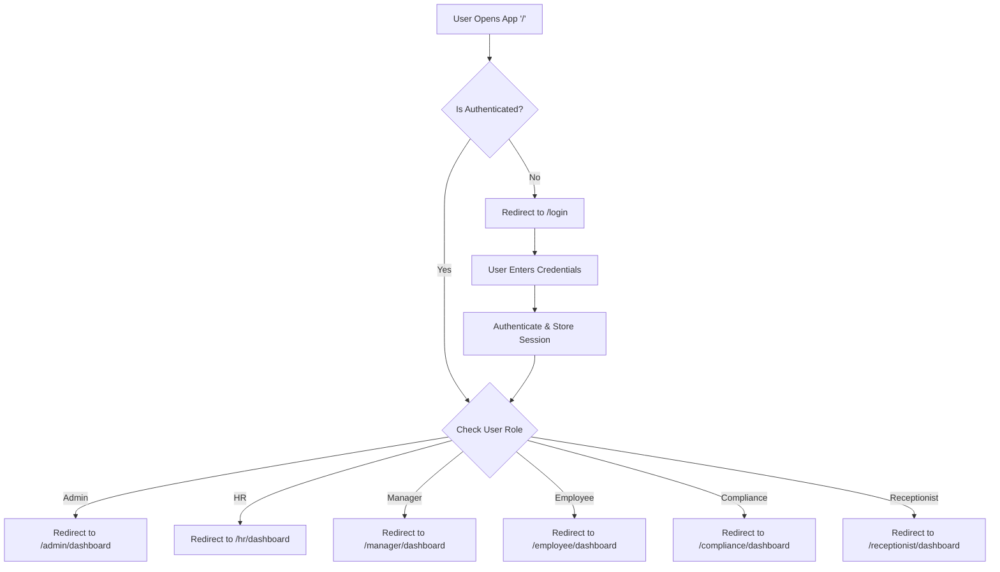
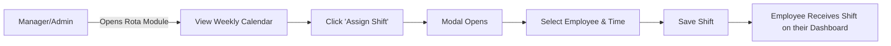
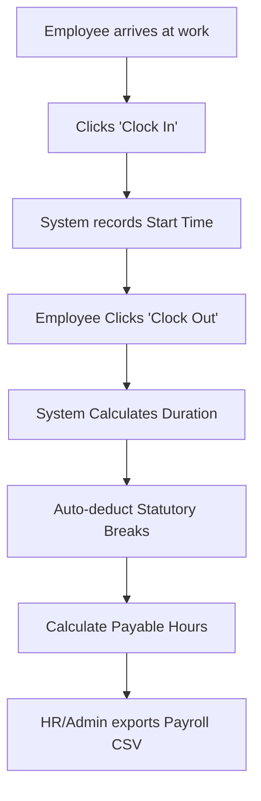

# Workflows & User Journeys

## 1. High-Level System Workflow

## 2. Authentication Workflow
1. User navigates to `/login`.
2. Inputs Username and Password.
3. System validates against mock state (future: API).
4. On success, context state `isLoggedIn` is set to `true`, and `currentRole` is mapped.
5. User is routed dynamically based on their role slug (e.g. `/hr/dashboard`).
6. Invalid URL navigation triggers 403 (Access Denied) if authenticated but unauthorized, or 404 (Not Found) if route does not exist.

## 3. Module Workflows

### 3.1 Rota & Shift Management Workflow

### 3.2 Leave Approval Workflow
1. **Request:** Employee opens 'Leave' module -> Clicks 'Request Time Off' -> Fills modal form -> Submits. State changes to 'Pending'.
2. **Review:** HR or Manager views their respective 'Leave' module -> Sees 'Pending' requests.
3. **Action:** Manager clicks 'Approve' or 'Reject'.
4. **Resolution:** Employee balance is updated; Status changes visually on Employee dashboard.

### 3.3 Attendance & Payroll Workflow

### 3.4 Form & Modal UI Workflow
*Standardized creation flow across all modules:*
1. User clicks Action Button (e.g. `+ Add Employee`, `+ Record Observation`).
2. `createPortal` mounts the floating Modal Component over the UI overlay.
3. User fills out responsive grid fields.
4. User clicks `Save`.
5. Modal unmounts, Context/State updates, UI table reflects new data immediately.
