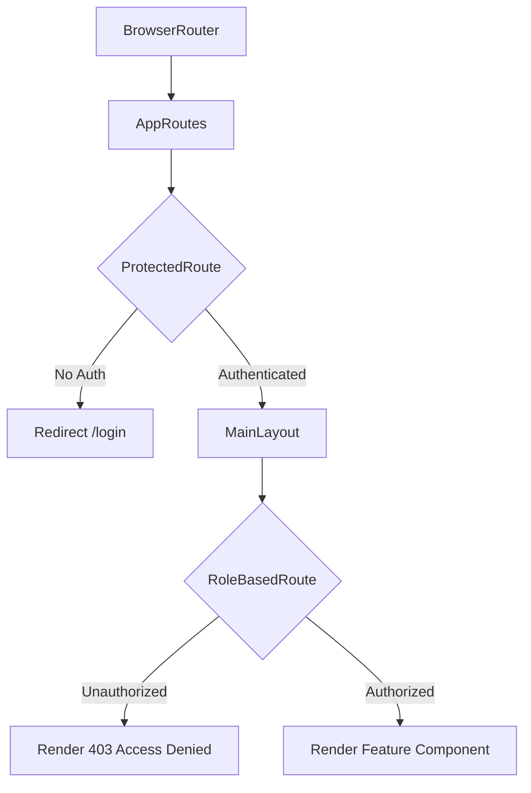

# Frontend Architecture

## 1. Core Architecture Strategy
The application is structured as a **Component-Based Single Page Application (SPA)** using React.js. It follows an enterprise-ready feature-based module structure, combined with centralized routing and layout boundaries.

## 2. Directory Structure
```
src/
├── assets/         # Static images, logos, global CSS variables (index.css)
├── components/     # Reusable UI elements
│   ├── features/   # Massive, complex module components (e.g., Payroll.jsx, Employees.jsx)
│   ├── Header.jsx  # Global header component
│   └── Sidebar.jsx # Global navigation component
├── constants/      # Immutable constants (roles.js, menus.js)
├── context/        # Global state management (AppContext.jsx)
├── layouts/        # Page layout wrappers (MainLayout.jsx)
├── pages/          # Route-specific View components
│   ├── admin/      # Dashboards specific to Admin
│   ├── hr/         # Dashboards specific to HR
│   ├── public/     # Unauthenticated pages (Login, 403, 404)
│   └── ...         # Other role-specific folders
├── routes/         # Security and routing configuration
│   ├── AppRoutes.jsx     # Master route map
│   ├── ProtectedRoute.jsx# Auth boundary
│   └── RoleBasedRoute.jsx# RBAC boundary
├── utils/          # Helper functions and mock data
└── main.jsx        # Application entry point
```

## 3. Routing & Security Hierarchy


## 4. Shared Component & UI Strategy
- **Modals:** All popup forms bypass the DOM hierarchy by utilizing `ReactDOM.createPortal`. This prevents CSS `overflow: hidden` bugs and ensures modals sit securely on the top `z-index` layer.
- **Tables:** Universal adoption of `<div className="overflow-x-auto w-full">` wrapping every `<table>` element. This guarantees mobile responsiveness without breaking grid structures.
- **Forms:** All forms use standard Tailwind Grid classes (`grid-cols-1 sm:grid-cols-2`) to collapse to a single column on mobile screens.

## 5. State Management (Current Phase)
The application relies on `src/context/AppContext.jsx`. 
- **Purpose:** Provide a centralized mock database and active user session state.
- **Migration Path:** When backend integration begins, this file will be hollowed out or replaced entirely by Redux Toolkit or React Query, leaving the UI components completely agnostic.
