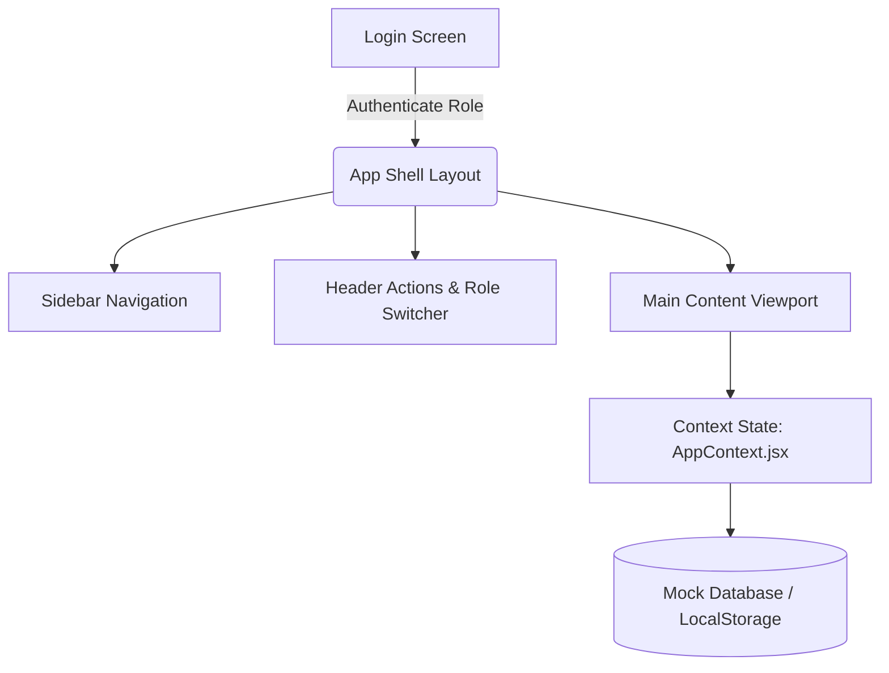
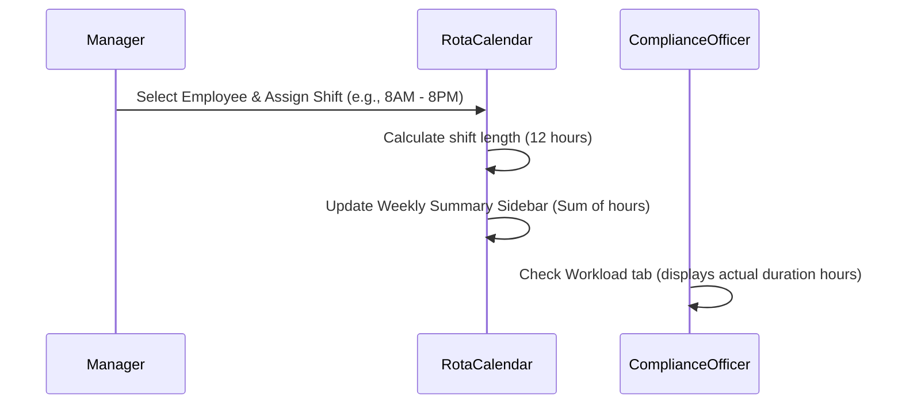

# AS Care Home - Project Working Flow & Guide

Welcome to the **AS Care Home Rota & Care Management System** working flow guide. This document details the application's architecture, user roles, primary modules, step-by-step operational workflows, and verification methods.

---

## 📋 Table of Contents
1. [System Overview & Architecture](#-system-overview--architecture)
2. [User Roles & Permissions Matrix](#-user-roles--permissions-matrix)
3. [Key Modules & Operational Flow](#-key-modules--operational-flow)
   - [A. Care Planning & Care Notes (PCS Style)](#a-care-planning--care-notes-pcs-style)
   - [B. Rota & Workload Management](#b-rota--workload-management)
   - [C. Policies & Training Compliance Matrix](#c-policies--training-compliance-matrix)
   - [D. Document Center & Automation](#d-document-center--automation)
   - [E. Audits & Compliance Reports (22 Forms)](#e-audits--compliance-reports-22-forms)
   - [F. Visitor Tablet (Receptionist)](#f-visitor-tablet-receptionist)
   - [G. Incident Reporting](#g-incident-reporting)
4. [Testing & Verification Guide](#-testing--verification-guide)
5. [Local Development & Commands](#-local-development--commands)

---

## 🏢 System Overview & Architecture

The system is a high-fidelity Single Page Application (SPA) built using **React (Vite)**, **TailwindCSS**, and **Vanilla CSS**. It manages rota schedules, HR documentation, care plans, regulatory compliance, and audits for a modern care home.



---

## 👥 User Roles & Permissions Matrix

The system supports 6 distinct roles, each having tailored dashboards and menu access. You can easily switch between roles using the dropdown selector in the header (development/testing mode).

| Role | Primary Responsibility | Key Accessible Modules |
| :--- | :--- | :--- |
| **Admin** | System configuration and overall oversight | All modules, System Settings, Audit Logs, Document Templates, Care Planning |
| **HR** | Staff management and recruitment documentation | Employees list, Leave/Payroll, HR Document Templates, Rota Calendar, Policies & Training |
| **Compliance Officer**| Care home regulatory standards and audits | 22 Audit Forms, Action Plans, Rota Workload Checks, Incident Reports |
| **Manager** | Day-to-day operations and staff coordination | Rota planning, Attendance, Leave, Document Verification, Audits, Care Planning |
| **Employee (Carer)** | Logging care, signature declarations, viewing shift rota | Employee Dashboard, Rota, My Documents (Read & Sign), Day Notes, Training |
| **Receptionist** | Visitor tracking & registration | Visitor Login/Logout Tablet, Receptionist Settings |

---

## 🔄 Key Modules & Operational Flow

### A. Care Planning & Care Notes (PCS Style)
Designed to mimic Person Centred Software (PCS) systems to log daily care notes and monitor resident wellness status.

1. **Dashboard & Overdue Alerts**:
   - Displays all residents with their status badges.
   - **Critical Warning Trigger**: If a resident has a logged "Care Refused" entry, or if their profile has not been updated with a Care Note for **more than 4 hours**, a pulsing **Red Overdue Alert Badge** appears on their card.
   - Shows a live **Recent Care Notes Feed**. Care refusals are visually flagged with a thick red left border, red background tint, and a warning icon.
2. **Resident Contacts (Editable)**:
   - When viewing a resident's details, you can toggle Edit Mode and directly edit their key contacts (Doctor/GP, Power of Attorney, Next of Kin, Social Worker).
3. **Care Note Submission**:
   - Care staff can submit a new care note.
   - Includes a `"Did the resident refuse care?"` toggle.
   - Displays the logged-in carer as author (e.g., `"Written by: John (Senior Carer)"`).
   - Quick shortcut button to log **Behaviour / ABC Charts** directly from the entry form.

---

### B. Rota & Workload Management
Calculates actual shift durations accurately and monitors staff workload.



1. **Shift Calculations**:
   - Calculates hours based on actual shift length:
     - `8AM–2PM` (6 hrs)
     - `2PM–8PM` (6 hrs)
     - `8AM–8PM` (12 hrs)
     - `8PM–8AM` (12 hrs)
2. **Weekly Workload Sidebar**:
   - Visible in the weekly Rota Calendar. Summarizes total hours allocated to each staff member for the selected week.
3. **Workload Check**:
   - Both Managers and Compliance Officers have access to a compliance view showing aggregate weekly scheduled hours per employee.

---

### C. Policies & Training Compliance Matrix
Tracks training progress and manages policy electronic signatures.

1. **Policies Compliance**:
   - Contains core policies: *Health & Safety, Safeguarding, GDPR, Whistleblowing, Infection Control*.
   - **Employee flow**: Logs in, goes to "Policies & Training", clicks "Read & Sign", reads the content, checkmarks the declaration, types their full name, and e-signs.
   - **Management flow**: Sees the compliance grid indicating who has signed which policy, alongside live completion percentage bars.
2. **Training Matrix**:
   - Interactive grid mapping Employees against training modules: *Medication, Moving & Handling, Fire Safety, Infection Control, Dementia Care*.
   - Color-coded badges: Completed (**Green**), In Progress (**Yellow**), Not Started (**Red**).
   - Managers/HR can click any cell to cycle/update training status instantly.
3. **Futuru.ai Portal**:
   - Link card to the external training partner `https://futuru.ai/` for direct staff course launching.

---

### D. Document Center & Automation
Saves administrative time by automatically generating customized employment letters.

1. **Recruitment Templates**:
   - Integrated templates:
     - **Invitation for Interview Letter**
     - **ID Verification Form** (Group 1 and Group 2b checks)
     - **Offer of Employment Letter**
2. **Job Descriptions**:
   - Preloaded descriptions for: *Manager, Team Leader, HCA Lead, HCA, Cook, Domestic Housekeeper*.
3. **Automation**:
   - Select template -> Select Job Description -> Input employee name -> System automatically builds the document with populated placeholders.

---

### E. Audits & Compliance Reports (22 Forms)
Ensures standard regulatory audits are completed with zero paperwork.

* **Core Forms**:
  - **Daily Walkaround / Records Audit**: Styled with a 6-column grid (`bg-[#92d050]`) mimicking the original Microsoft Word format. First row displays red-bolded instructions.
  - **Mealtime Audit**: Categorized into 4 sections with intermediate section scores and a dynamic overall scoring matrix.
  - **Dignity Audit**: Swan Care Home theme, pre-filled with 40 benchmark comments/actions.
  - **Call Bell Audit**: Light blue theme (`bg-[#d9e1f2]`), response time calculator, and resident feedback grid.
  - **Mattress & Cushion Audits**: Inverse scoring (e.g. Cover breach / compromised zip equals a `YES` representing immediate `0%` failure; compliance equals `NO`).
  - **17 Checklist Audits**: Renders standard dynamic checklist screens.
* **Flow**:
  1. Auditor selects form -> Answers questions (YES / NO / N/A).
  2. Scoring widgets update in real-time.
  3. Action plans are added directly for any failures.
  4. Auditor and Manager review signatures are typed in and submitted.
  5. Saved reports are accessible in read-only format (`isReadOnly={true}`) with smart mock values pre-loaded if data is missing.

---

### F. Visitor Tablet (Receptionist)
Allows visitors, contractors, and relatives to log visits upon entering the building.

1. **Log In/Out Forms**:
   - Visitor fills out details: Name, purpose, host, check-in time.
   - **QR Code Check-in**: Displays a scanning mock modal allowing users to quickly register visits via a phone scan simulation.
2. **Dashboard Grid**:
   - Displays currently signed-in visitors. Receptionist can sign them out with one click.

---

### G. Incident Reporting
Tracks internal accidents, slips, or medication errors.

1. **Submission Form**:
   - Date, category, description, and immediate action taken.
2. **Review Feed**:
   - Management reviews ongoing reports and sets status (Open, Under Investigation, Resolved).

---

## 🔬 Testing & Verification Guide

To test the features end-to-end:

### Test Case 1: Care Note Refusal & Overdue Alerts
1. Log in as **Employee** or **Manager** (or select via header role switcher).
2. Go to **Care Planning** -> Select a resident (e.g., "Margaret Thatcher").
3. Click **Add Care Note** -> Fill description, click **YES** under *"Did the resident refuse care?"*. Click **Save Note**.
4. Go back to the dashboard. Observe the resident's card now has a red pulsing overdue badge and warning banner.
5. In the **Recent Care Notes Feed**, see your note outlined in red indicating refusal.

### Test Case 2: Rota Hours Verification
1. Log in as **Manager** or **Admin**.
2. Go to **Rota** calendar. Add a shift for an employee (e.g., `8AM - 8PM`).
3. Check the **Weekly Workload Summary** sidebar on the right; the employee's total hours will increase by exactly `12` hours (not 8).
4. Select `8AM - 2PM`; check that it updates by exactly `6` hours.

### Test Case 3: Policy Signature E-Sign Flow
1. Log in as **Employee**.
2. Navigate to **Policies & Training**.
3. Under the **Policies** tab, click **Read & Sign** on "Health & Safety Policy".
4. Review content, check the box, type your name, and click **Sign Policy**.
5. Switch to **Manager** or **Admin** role in the header -> Navigate to **Policies & Training** -> Observe the completion matrix update in real time showing that employee signed the policy.

### Test Case 4: Complete a Call Bell Audit
1. Log in as **Compliance Officer** or **Manager**.
2. Go to **Audits** -> Select **Call Bell Audit** -> Click **Start New Audit**.
3. Enter testing room times (e.g., room 101: `15s`, room 102: `45s`). Observe the average response time auto-calculate.
4. Input auditor details at the bottom and click **Submit**.
5. Find your submitted audit in the history table and click **View** to verify it renders read-only correctly.

---

## 💻 Local Development & Commands

### Running the Project
The application is preconfigured and can be run locally using Node.js:

```bash
# Install dependencies (if not already done)
npm install

# Start Vite development server
npm run dev
```

### Production Build
To test compilation and make sure there are no syntax or React errors:

```bash
npm run build
```
The output files will be built into the `dist/` folder.
